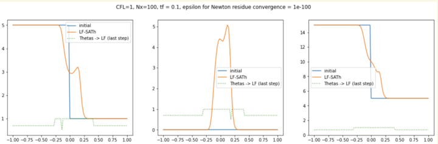

# Adaptive Implicit Schemes for Hyperbolic Equations

The main branch contains the code used to write the report. this code is functional but still carries bugs. It cannot compute solutions for the RIPA model.
The "Prototype" branch contains the version of the code (with vectorized code for more variables in the PDEs, as in RIPA). It is not functional, has a lot of bugs, but gave one promising result for the RIPA model:

To load a simulation, modify the parameters as you wish in the args.json file, and run simulation.py (with the option 'plot' or 'noplot' if you want a saved image or not):

## args.json: the JSON file to set up your parameters. You can leave it empty, the program has an initial dictionary containing default values. Change only the parameters that interest you:
  - "a" & "b": coordinates of the borders of the 1D domain.
  - "Nx": number of spatial nodes.
  - "cfl": CFL condition.
  - "tf": the duration of the simulation.
  - "Problem": The PDE you want to compute. ("Linear_advection", "Burgers", "RIPA")
  - "coefficients": If needed, the coefficient to define the flux function. Must always be a list. Only needed, for the Linear Advection, in the form [$a$], with $a$ the speed of the wave.
  - "init_func": the type of initial function. ("jump1", "jump2", "bell", "sine_shock" ; for RIPA: "smooth", "flat", "nonflat" but not everything works well...)
  - "init_function_params": the coordinates to define your initial function. [d_0, ... d_M, u_0, ... u_N]
    with d_i : Location(s) of the singularities/bell (left to right) and u_j : values of the constant segments (left to right).
  - "Scheme": The type of Scheme: "Theta" or "SATh".
  - "Flux": The type of numerical flux: "Upwind" or "LF" (for Lax-Friedrichs).
  - "Boundary": The type of boundary. ("dirichlet" or "periodic")
  - "Theta_st": The parameter $\theta^*$.
  - "Theta_min": The parameter $\theta_{min}$.
  - "Theta_max": The maximum value we want theta to reach when close of a discontinuity.

## Run one simulation and obtain the corresponding plot:
python3 -m venv .venv +
source .venv/bin/activate +
pip install --upgrade pip +
pip install -r requirements.txt +
source .venv/bin/activate +
python3 simulation.py plot
